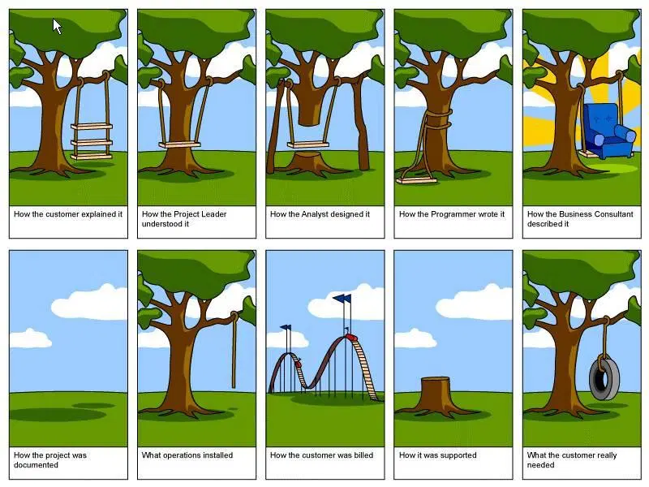

# Quest 00. 데브옵스란 무엇인가

## Introduction
* 이번 퀘스트에서는 데브옵스가 무엇인지, 이러한 개념이 왜 나오게 되었는지 등에 대해 다룰 예정입니다.

## Resources
* [DevOps란 무엇입니까?](https://aws.amazon.com/ko/devops/what-is-devops/)
* [DevOps란?](https://azure.microsoft.com/ko-kr/overview/what-is-devops/)
* [DevOps](https://cloud.google.com/devops/?hl=ko)
* [DevOps](https://en.wikipedia.org/wiki/DevOps)

## Checklist
* 만약 비개발자에게 데브옵스가 무엇인지 설명하게 된다면 어떻게 설명할 수 있을까요?
  * 소프트웨어를 유지보수하는 데 있어 크게 개발과 운영, 두 가지 과정이 존재합니다. DevOps라는 개념이 본격적으로 정립되기 전까지 이 두 영역의 엔지니어들은 서로의 역할을 잘 이해하지 못하고, 이로 인한 silo화와 커뮤니케이션 및 업무 상의 비효율성이 동반되기 일쑤였습니다. DevOps는 두 영역 간의 경계를 허물고자 하는 엔지니어링 문화이며, 이는 현대 소프트웨어 기술의 발달로 인해 비로소 가능해졌습니다. 기술이 문화를 만들어 내고, 문화가 기술 발전을 지원하는 거죠.
  그 전까지 개발과 운영 간의 싸움은 개선과 안정 간의 싸움이라 할 수 있었습니다. 당연히 비즈니스 환경에서 두 가치는 감히 저울질할 수 없이 모두 중요한 가치들이죠. 앱 개발자들은 고객들의 니즈에 맞춰 신속하게, 그리고 끊임 없이 소프트웨어를 개선하고 싶어 합니다. 반면 인프라 엔지니어들은 새 버전의 소프트웨어에 잠재적으로 숨어 있는 문제를 미연에 방지하고 안정적인 서비스를 유지하고 싶어 하죠. 엔지니어가 프로덕트 매니저의 요구를 사양하는 것과, 시스템 엔지니어가 앱 개발자의 요구를 사양하는 것, 어딘가 쏙 빼닮지 않았나요? 둘 다 좋은 서비스를 만들기 위해 최선을 다한 결과지만, 자칫 커뮤니케이션에 문제가 생기면 외려 헤메게 되고 맙니다.
  이 중 엔지니어들 간의 문제를 해결해 봅시다. DevOps는 소프트웨어 생명 주기 전체에 걸쳐 지속적이고 안정적인 파이프라인을 구축하고 유지보수함으로써, 프로덕션 환경에 배포되는 소프트웨어의 안정성을 높이고, 고객에게 전달되는 속도를 빠르게 하고자 하는 문화입니다. 이 아이디어를 실현시키 위한 시도로 대표적인 기술들이 도입되어 왔습니다. 이는 다음 문단에서 다루겠습니다.
* 데브옵스라는 개념 이전의 소프트웨어 개발은 어땠을까요? 어떤 요구사항을 충족하기 위해 데브옵스라는 개념이 생겼을까요?
  * DevOps가 발전하기 이전의 소프트웨어 개발, 그리고 배포는 아주 위험한 과정이었습니다. 이 장정을 한번 가볍게 훑어 보겠습니다. 먼저 앱 개발자가 비즈니스 요구 사항을 프로덕트, 디자이너, PM 등 직군과 조율하여 소프트웨어 스펙을 받아 듭니다. 앱 개발자는 이 스펙을 구현하기 위한 어플리케이션 코드를 작성합니다.
  * 우선 비즈니스 상 니즈를 스펙으로 옮기는 과정부터 난관이 존재합니다.
  
  제품에 대한 비즈니스 상 비전을 가진 경영진, 제품에 대한 고객의 구체적인 경험을 명세화하는 프로덕트 매니저, 그리고 이를 고객이 실제로 경험하게 되는 UX로 설계하는 디자이너와 엔지니어까지 이르면서 제품의 모습은 많은 변화를 겪습니다. 이는 불가피하고 사실 좋은 현상이기도 하지만, 문제는 이들이 제품에 관한 **도메인 지식**을 공유하지 않는다는 데 있습니다. 또한 직군 간의 jargon에 종속되지 않는 **Ubiquotuous Language**가 약속되지 않는다면 의사소통 자체가 효율적으로 이루어지지 못하고 신호 대비 노이즈가 잔뜩 올라가고 말 것입니다. 직군이 다르면 어차피 커뮤니케이션은 힘들겠지 하는 무책임한 문화에서 탈피하여, 팀 전체가 제품에 대한 통일된 비전을 갖는 것이 중요하다 할 수 있겠습니다.
  * 이제 소프트웨어의 품질과 안정성을 높이기 위해, 앱 개발자가 작성하는 코드 자체의 퀄리티 컨트롤이 필요합니다. 소프트웨어 엔지니어링에는 "버그는 최대한 빨리 발견될 수록 좋다."라는 격언이 있습니다. 그러니까 버그가 발생할 수 있는 잠재적인 단계를 모두 점검해 보아야 합니다. 우선 소프트웨어가 동작하는 것을 확인해 보려면 작성한 코드가 바이너리 형태로 **컴파일**되어야 합니다. 컴파일 과정에서 에러가 발생했다는 것은 코드 자체가 갖고 있는 오류를 컴파일러가 사전에 발견하였단 뜻입니다. 그런데 컴파일 과정 자체도 프로그램이 커질 수록 적잖은 자원이 소모됩니다. 그 이전에 오타 등 아주 사소한 실수 정도는 캐치해 준다면 효율적이겠죠? 이를 **린터**가 수행해 줍니다. 린터는 코드가 지정된 스타일을 준수하는지 여부만 빠르게 체크해 주며, 팀 내에서 통일된 코드 스타일을 강제할 수 있다는 이점도 제공합니다. 어차피 코딩 시간의 대다수는 다른 프로그래머의 코드를 읽는 시간이니까요.
  * 문법적으로는 문제 없는 코드라 하더라도 예기치 않은 동작을 수행할 수 있습니다. 의도 대로 코드가 작동하는지 시나리오 마다 테스트를 거쳐 최대한 검증해야 합니다. 특정 모듈(=함수)이 특정 시나리오에 맞게 수행되는지 검증하는 것을 **유닛 테스트**, 프로그램 내에서 여러 함수를 거쳐 실행되는 보다 복잡한 시나리오는 **통합 테스트**라고 합니다. 유닛 테스트를 통해 전체 코드가 얼마나 검증되었는지를 **코드 커버리지**라는 지표로 파악합니다만, 절대적인 코드 품질 지표는 아닙니다. 물론 전반적인 버그 발생률과 반비례하는 경향이 있으니 참고할 만한 지표지요.
  * 오래 전에 서버에 배포되는 소프트웨어는 각 서버마다 다른 구성을 가지기 일쑤였습니다. 서버마다 배포되는 소프트웨어의 버전이 안 좋은 의미에서 파편화되었으며(좋은 의미는 뒤에서 다룸), 프로덕션 환경에서도 서버 구성이 수시로 변경되곤 했는데, 문제는 각 서버마다 구성이 천차만별로 달라지고 이를 추적하는 것도 불가능했다는 겁니다. 그래서 로컬 환경에서는 없었던 버그가 프로덕션에서 발생했을 때, 무점검으로 이를 발견하고 해결하는 것은 시스템 엔지니어들의 악몽이었습니다.
  이를 해결하기 위한 시도가 **Immutability**라는 개념입니다. 소프트웨어가 한번 서버에 배포되고 나면, 내려갈 때까지 구성이 변경되지 않는 것을 담보하는 것입니다. Chef, Ansible, Puppet 등의 **구성 관리 도구(CM)** 가 등장하면서 서버 구성을 코드 형태로 관리할 수 있게 되었습니다. 이를 **코드형 인프라**라고 하며, 서버 운영 과정에 코드의 이점(가독성, 협업, 자동화 등)을 도입할 수 있습니다. Terraform과 같이 VM, DB 등 외부 인프라를 선언적으로 관리하는 시도도 널리 퍼지게 되었습니다.
  Immutability를 구현하기 위해, 서버 VM 위에 구동되는 프로그램을 **이미지**화하여 올리기도 하는데, 이를 **Automated Machine Image(AMI)** 라고 합니다. 현대 프로덕션 환경에서는 아예 프로그램 별로 경량 이미지를 빌드하여 프로그램이 구동될 환경을 갖추어 주는데 이를 **컨테이너**라고 합니다. Docker라는 기술이 de-facto standard 급으로 유명하죠. 컨테이너는 가볍고 그 수도 비약적으로 늘어날 수 있는데, 이들을 스케줄링, 오케스트레이션해주는 기술로 Kubernetes 등이 활용되고 있습니다.
  * DevOps는 소프트웨어의 안정성을 높이고 고객에게 완성된 제품을 신속하게 전달하여 서비스의 비즈니스 지표를 향상시키고자 함을 핵심 가치로 삼습니다. 이 과정에서의 꽃이 소프트웨어를 프로덕션 환경에 배포하는 것입니다. 테스트를 마친 소프트웨어를 AMI 내지 컨테이너 형태로 빌드를 마치고 나면, 이를 **이미지 레지스트리**에 먼저 푸시해 둡니다. 이때 사람이 직접 체크하고 배포하는 것을 **지속적 통합**, 배포까지 자동화하면 **지속적 배포**가 됩니다. 지속적 통합은 여러 엔지니어들의 코드 베이스가 자동화된 빌드와 테스트를 통과한 후 메인 리포지토리에 통합되는 것까지 보장하는데, 지속적 배포는 코드 변경이 곧 배포까지 자동으로 연결됩니다.
  이렇게 소프트웨어가 개발 클러스터에 배포된 후에는 최종적으로 전체 서비스에서의 작동을 체크합니다. 이를 **end-to-end 테스트**, e2e라고 합니다. e2e까지 무사히 통과하면 비로소 위험성이 최소화된 것입니다. 드디어 프로덕션에 새로운 버전의 소프트웨어를 배포하게 되는데, 이를 **릴리즈**라고 합니다. 릴리즈 이후에도 새 버전이 어떤 문제를 불러올지 알 수 없으므로 Green-Blue 배포, Canary 배포 등 다양한 전략이 적용됩니다.
  * 성공적으로 릴리즈가 완료된 이후에도 서비스의 **Reliability**를 위해 인프라의 **Visibility**를 확보해야 합니다. 이를 위해 **모니터링**이 적용되어야 하고, 또 **로깅**이 수반되어야 하는데요. 그런데, 로깅은 굉장히 비싼 작업이죠! 서버 위에서 일어나는 모든 이벤트를 기록해 버리면, 스토리지가 순식간에 어마어마하게 증식하고 말 겁니다. 그러므로, 말 그대로 모든 이벤트 자체는 그저 컨테이너에 마운트된 로컬 영역에 ephemeral하게 존재할 뿐이고, 실제로 비즈니스적으로 가치가 있는 이벤트는 별도의 로깅 API를 통해 centralized MQ에 푸시되어 관리되게 됩니다. 이렇게 인덱싱된 로그에 semantic한 의미를 적용하여 조회하는 엔지니어는, 그 지표가 비즈니스 상에서 어떤 의미를 갖는지 유의하여 해석해야 합니다. 단순히 SLO만을 맞추기 위한 지표 관리라면 그냥 코드 하나로도 가능하니까요. 예컨데 Prometheus는 주요 지표를 HTTP로 끌어와 시계열 InfluxDB에 저장하고 PromQL로 처리할 수 있도록 지원하고 있습니다.
* 데브옵스 엔지니어가 따로 존재하는 조직과 따로 존재하지 않는 조직은 각각 어떤 장단점을 가지고 있을까요?
  * 저는 기본적으로 DevOps 엔지니어는 팀이 유지보수하는 소프트웨어의 **Maintainability**에 가장 큰 책임을 가진다고 생각합니다. 즉, 앱 개발자들의 생산성을 서포트하는 거죠. 그래서 개발환경 세팅, 빌드 스크립트 작성, 인하우스 유틸리티 툴 개발 등 매번 골머리를 앓을 만한 작업을 도맡아 하게 되죠. CI/CD 파이프라인 구축이나 코드형 인프라 유지보수, 보안 정책 관리는 일반 엔지니어도 어렵지 않게 배울 수 있을지도 모르지만, 본업인 앱 개발에서 일탈하기엔 시간이 너무 아깝죠.
  * 또 DevOps 문화는 기술 간의, 그리고 사람 간의 **Heterogeneity**라는 토양 위에서 자란다고 생각합니다. 다양한 기술 스택과 사람들의 경험이 seamless하게 어우러지려면 각각이 decoupled되어 개성이 보장되면서도, 그 사이의 silo가 제거되어야 하니까요. 각자의 환경에 세팅된 바이너리를 Docker 컨테이너에 격리하여 Kubernetes 클러스터 상에서 함께 운용하는 것은 바로 이런 Diversity in Unity를 드러내는 일례라고 봅니다.

## Quest
* 발급받은 AWS 계정에 접속해 봅니다.
* 본인의 루트 AWS 엑세스 키 ID와 비밀 엑세스 키를 생성하고, 본인의 로컬 머신에 저장해 놓습니다.
* 새로운 무언가를 생성하지는 않은 상태에서, 어떤 것들이 있는지 둘러봅니다!
* 과제 리뷰용 IAM 계정을 하나 만들어서 저에게 알려 주세요.
  * 콘솔의 IAM 메뉴에 들어가서, 왼쪽의 `엑세스 관리` -> `사용자`에 들어가서 `사용자 추가`를 클릭합니다.
  * 사용자 이름에 `kcho@knowre.com`을 입력하고, 엑세스 유형에 `프로그래밍 방식 엑세스`와 `AWS Management Console 액세스`를 모두 클릭합니다.
  * `자동 생성된 비밀번호`와 `비밀번호 재설정 필요`를 체크합니다.
  * `권한 설정`에서 `기존 정책 직접 연결`을 선택한 뒤, `AdministratorAccess`를 체크하고, 하단의 `다음:태그`와 `다음:검토`를 계속해서 누른 뒤, 사용자를 만듭니다.
  * `액세스 키 ID`와 `비밀 액세스 키`, `비밀번호`, 그리고 위의 안내에 써 있는 접속을 위한 `https://[12자리숫자].signin.aws.amazon.com/console` URL을 저에게 보내 주시면 됩니다!

## Advanced
* SRE(Site Reliability Engineering)는 어떤 개념일까요?
  * SRE는 Google에서 등장한 DevOps의 일종의 polymorphism이라 할 수 있습니다. 이름에서 드러나듯 Google에서는 여러 가치 중 Reliability를 가장 중요시하는데, 이는 단적으로 **error budget**이라는 문화에서 엿볼 수 있습니다. SLO에서 정해 놓은 서비스 다운 시간 한도에서 가장 극단적인 피처 배포 속도를 지향하죠. 어차피 고객들이 보기에 백엔드 단에서의 오류는 관찰할 수 없는 블랙박스 같은 존재인데, 고객이 눈치 채지 못할 정도의 다운률 안에서는 신속하게 변화를 적용하는 것이 비즈니스에서 유리하게 작용한다는 사실을 깨달은 데서 나온 결단이죠.
  Netflix에서도 이 가치와 일맥상통하는, Chaos Engineering이라는 문화가 있습니다. 이곳에서는 아예 Game Day를 정해서 프로덕션 위의 VM, 심지어 AZ를 통째로 날려버리는 무시무시한 실험을 감행합니다. 시스템의 **Resiliency**가 충분하다면, 이런 상황이 일어나도 서비스가 무너지지 않는다는 거에요. Netflix는 이 오류 상황을 DevOps 엔지니어가 극복하는 과정에서 성장하고, 시스템도 더욱 굳건해진다고 믿습니다.
  DevOps, SRE, Chaos Engineering 모두 서비스의 안정성을 높이기 위한 접근 방식이지만, DevOps는 Maintainability를 강조하면서 시작되고, 둘은 거대한 두 기업답게 Reliability가 강조되고 있습니다.
* 미래의 데브옵스 직무는 어떻게 변화할까요? 여러 가지 미래를 상상해 봅시다!
  * 예전에는 예컨데 소프트웨어 엔지니어와 DBA 간의 경계가 모호했습니다. 이후 웹이 탄생하고 데이터가 폭증하면서 DB를 전문적으로 다루는 DBA가 탄생했습니다. 그리고 21세기를 맞아 웹이 새로운 국면을 맞고, 웹 환경도 더욱 풍성해졌습니다. 이때부터 모든 작업을 풀스택으로 수행하던 소프트웨어 엔지니어가 FE 엔지니어와 BE 엔지니어로 분화되기 시작합니다. 그리고 2010년대 이후 클라우드 서비스가 성장하면서, 소프트웨어 엔지니어와 시스템 엔지니어는 DevOps 엔지니어로 수렴진화하게 됩니다.
  빅데이터라는 buzz word가 나오기도 전부터 이미 데이터는 매년 40% 이상 성장하고 있습니다. 그리고 이 데이터를 자본으로 활용하는 머신 러닝 기술도 이젠 도외시할 수 없게 되었습니다. DevOps가 나아가게 될 가능성 중 하나는 바로 데이터에 있을 것입니다. 시스템 엔지니어링은 사람이 직접 터미널에 커맨드를 입력하는 과정에서부터, 스크립트를 활용한 크론잡, 그리고 여러 프로그램들을 직접 오퍼레이터로 오케스트레이션하는 단계에까지 이르렀습니다. 하지만 작업이 완전히 사람 손을 떠나려면 머신 러닝, 즉 데이터의 활용이 필요합니다.
  지금까지 인프라에서 발생하는 지표의 모니터링을 자동화할 수 있었던 것은 해당 데이터를 정규화하여 표현할 수 있었기 때문입니다. 그런데 실제 비즈니스 상 의미 있는 이벤트들은 비정형의 데이터를 갖고, semantic한 측면에서 해석되어야 하기 때문에 엔지니어가 직접 해석해야 하죠. 이 breakthrough로써 MLOps라는 개념이 제시되었고, 가까운 미래에는 서비스에서 쏟아져 나오는 데이터를 통해 시스템이 스스로 자기 상태를 파악하고, 일종의 항상성, Reliability를 지향하는 방향으로 발전할 것입니다.